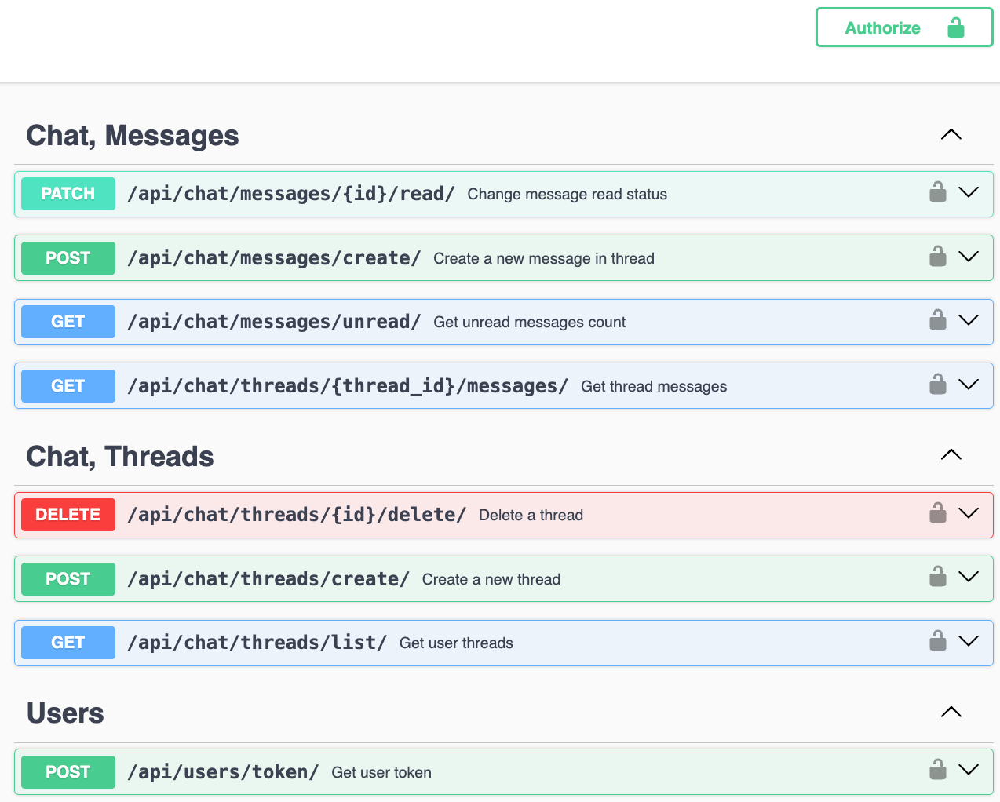

# iSi_Chat

A simple chat application built with Django and Django REST Framework. The application allows users to create threads (conversations), send messages, and manage their chat interactions.

## Project Description

This chat application provides a way for users to communicate via threads, where each thread is a conversation between two participants. Users can send messages within threads, mark messages as read, and view their unread message count.

## API Endpoints

### Interactive Documentation available here:
#### [http://127.0.0.1:8000/api/schema/swagger/](http://127.0.0.1:8000/api/schema/swagger/)


## Running the Project

### Prerequisites

- Python 3.10+
- SQLite DB (included to Repo)

### Installation

1. **Clone the repository:**
    ```bash
    git clone https://github.com/roman-zahoruiko/isi_chat.git isi_chat-roman-zahoruiko
    cd isi_chat-roman-zahoruiko
    ```
2. **Create and activate a virtual environment**
    ```bash
    python3 -m venv venv
    source venv/bin/activate
    ```
3. **Install dependencies:**
    ```bash
   pip install -r backend/requirements.txt
   ```
4. **Run the development server:**
   ```bash
   python backend/manage.py runserver
   ```
5. **Access the application:**
- #### Open your browser and go to [http://127.0.0.1:8000/admin/](http://127.0.0.1:8000/admin/)
- #### Interactive Documentation available here: [http://127.0.0.1:8000/api/schema/swagger/](http://127.0.0.1:8000/api/schema/swagger/)
- #### Example Users

| Username   | Password | Token                                                |
|------------|----------|------------------------------------------------------|
| testuser1  | password | 843520fea815df0dc2a4516bb1a8fe190b4aa89b             |
| testuser2  | password | 66c95fdd1f43cc2528d93a8ba81d30830b4a9ea6             |
| testuser3  | password | not created yet                                      |

### Running Tests
```bash
cd backend
python manage.py test
```